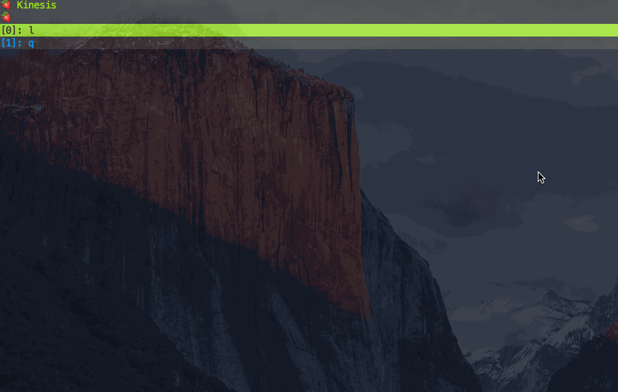

# 💠 Rawst

The interactive tool for AWS CLI written in Rust




## Feature

## Supported Services by Rawst

###  AWS
  - Kinesis Streem


### Build

```
$ cargo run
```

if you encounter following error

``` 
error: failed to run custom build command for `openssl v0.7.14`
```

please set these environment variables.


``` bash
$ export OPENSSL_INCLUDE_DIR=/usr/local/opt/openssl/include
$ export DEP_OPENSSL_INCLUDE=/usr/local/opt/openssl/include
```
